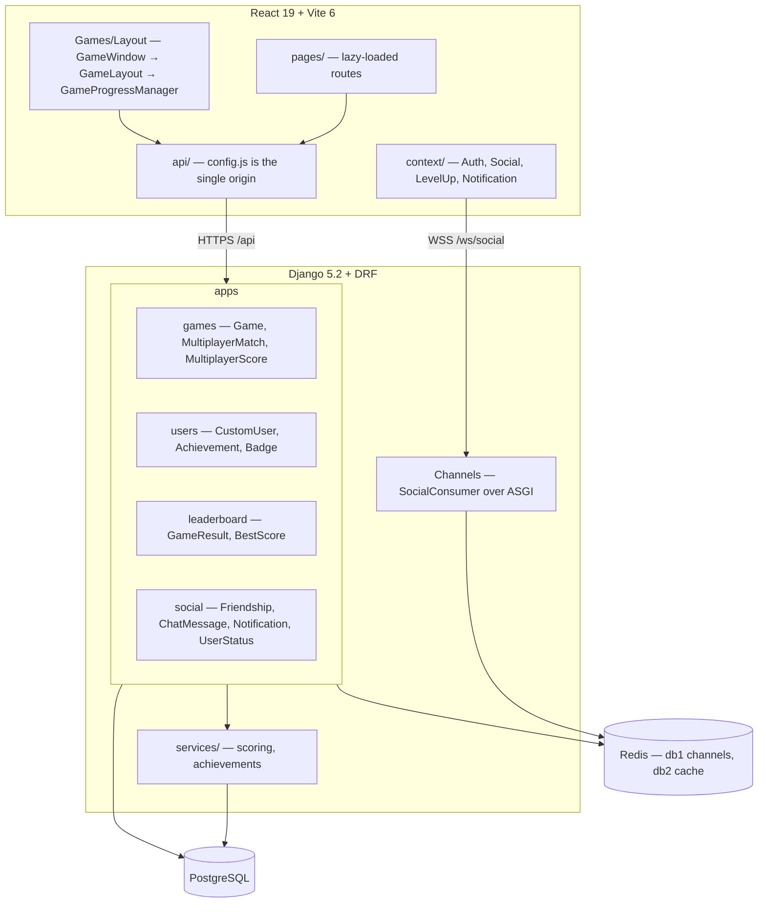
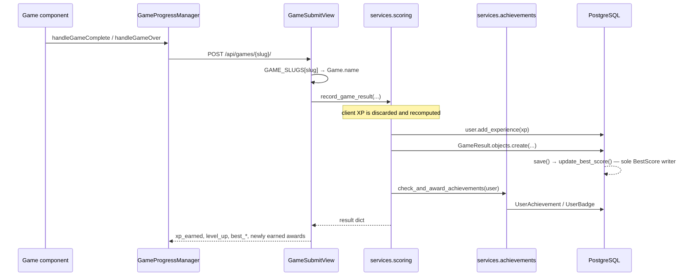
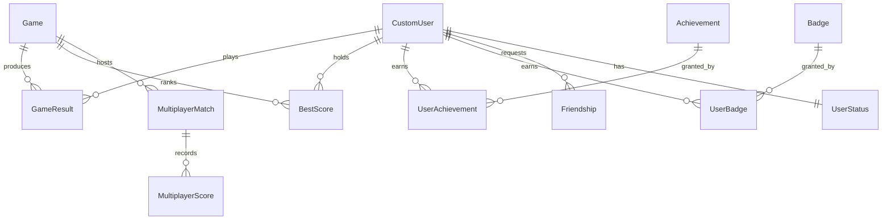

# Cognitive — architecture

State after the Phase 1 refactor. A machine-readable graph (970 nodes, 2023
edges) can be regenerated at any time with:

```bash
graphify . --code-only && graphify cluster-only .
```

That writes `graphify-out/` (gitignored): `graph.html` for an interactive view,
`graph.json` for querying, `GRAPH_REPORT.md` for community structure. Community
naming needs an LLM API key; without one they stay as `Community N` placeholders.

## System



## Submission path

The single flow that matters most — one game result travelling from the browser
to the leaderboard.



## Data model



`GameResult` is the append-only log of every play. `BestScore` is the
per-(user, game) rollup that every leaderboard reads; it is written **only** by
`GameResult.save()`. `GameScore` still exists and is marked deprecated.

## Conventions worth knowing

- **Games are data, not code.** `games/registry.py` maps 35 URL slugs to
  `Game.name`; one `GameSubmitView` serves all of them. Adding a game is a
  registry entry plus a row from `manage.py populate_games` — not a new view,
  serializer and URL.
- **Names are the join key.** `Game.name` is unique and is how a submission
  finds its game. `registry.py`, `populate_games.py` and the seeded rows must
  agree exactly.
- **The client never sets XP.** `services/scoring.calculate_game_xp` recomputes
  it from base reward, level, score, streaks and mistakes.
- **One API origin.** `frontend/src/api/config.js` reads `VITE_API_URL`. Nothing
  else should contain a backend hostname.
- **Redis is required.** db 1 backs the Channels layer, db 2 the cache. The
  in-memory channel layer is per-process, so HTTP→WebSocket pushes silently
  reach nobody under more than one worker.

## Known debt carried into Phase 3/4

- `GameLayout` calls `useEffect` inside a render-prop callback
  (`react-hooks/rules-of-hooks`). The Phase 4 game engine replaces this stack.
- Scores are still client-supplied and forgeable; the serializers' old "proof"
  fields never validated anything. Server-side verification is a Phase 4 item.
- `pages/Profile.jsx` is ~2,000 lines; `context/SocialContext.jsx` ~845.
- No multiplayer WebSocket consumer — match status is polled over HTTP.
- `GameResult.duration_seconds` is migrated but never written.
- Seed data writes `badge_type` values absent from `Badge.BADGE_TYPES`.
- `npm run lint`: 132 errors / 33 warnings, nearly all pre-existing
  `no-unused-vars` and `no-case-declarations` in files the redesign replaces.
